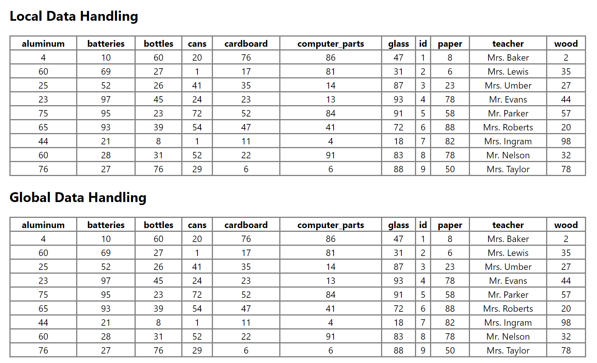
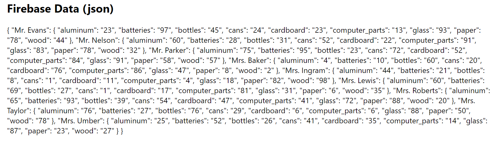

# UW Blueprint Starter-Code

The starter code for UW Blueprint projects! Made with love by the project-infra team!

## Introduction

We are UW Blueprint, a student-run organization at the University of Waterloo. We
build technology for non-profit organizations free of charge! We've found that it
takes several weeks for each team to setup the boilerplate code for their projects
and that projects independently converge to very similar tech stacks. To solve
this issue, we've created the starter-code project! The starter-code project allows
teams to setup, develop, and deploy projects faster which allows UW Blueprint to
better serve our non-profit partners.

## The Tech Stack

These technologies are proven, popular, easy to learn, and provide fast development speeds.

- Frontend: React + Redux
- Backend: Python + Flask + PostgreSQL OR Firebase

## Example Project (Blueprint Bootcamp)

The example project shows how to build on top of the boilerplate code using
the following scenario:

### Recycling Race!!!

A local elementary school is running a recycling race between all of the classes!
Each class is fiercely competing to recycle the most items! They’ve asked UW
Blueprint to build an app that can help keep track of each class’ recycling progress.

### Setup

The dev environment is containerized with Docker to minimize setup efforts. These instructions are written with the bootcamp in mind but can be adapted to generic uses with some minor modifications.

1. Install Docker Desktop (skip tutorials): [MacOS](https://docs.docker.com/docker-for-mac/install/) | [Windows (Home)](https://docs.docker.com/docker-for-windows/install-windows-home/) | [Windows (Pro, Enterprise, Education)](https://docs.docker.com/docker-for-windows/install/) | [Linux](https://docs.docker.com/engine/install/#server)
```
# verify your installation by running the following in a terminal
$ docker --version
$ docker-compose --version
```

2. Clone the starter-code repository and go into the project directory
```
$ git clone https://github.com/uwblueprint/starter-code.git
$ cd starter-code
```

3. Choose your backend, either Python + Flask + PostgreSQL, or Firebase ([guide](docs/CREATING_A_PROJECT.md))

    a. Skip to step 5 if using Python + Flask + PostgreSQL
    
    b. Proceed to step 4 if using Firebase


4. (Firebase only) Create a Firebase project with a Cloud Firestore database

    a. Go to the [web Firebase console](https://console.firebase.google.com/) and create a new project

    b. Click on Settings > Users and permissions, then add everyone on your team as a user

    c. Generate a Firebase API key. If there is already an existing API key, please ask the owner to give it to you (not through Git). For regular projects, we will be using an internal secret management system to share sensitive credentials, but we will forgo it for the bootcamp as not everyone has been onboarded yet.

    In the web Firebase console, click on Settings > Project settings > Service accounts > Create service account (if none exists) > Generate new private key

    d. Copy all the contents of the file generated in step c into `backend/db/config/serviceAccountCredentials.json`
    ```
    $ cd backend/db
    $ mkdir config
    $ cd config
    $ touch serviceAccountCredentials.json
    ```

    e. In the web Firebase console, click on Cloud Firestore and create a new database. Select "start in test mode" and use the default region.

5. Run the application, then skip to step 9 if using Python + Flask + PostgreSQL
```
$ docker-compose up --build
```

6. (Firebase only). In a separate terminal, run `docker ps` to get the container name of the backend, it's probably `starter-code_backend_1`. Then run:
```
$ docker exec -it <CONTAINER_NAME> /bin/bash
# (Now inside the running container)
$ pipenv run python init_firestore_db.py
```
In the web Firebase console, click on Cloud Firestore. Verify the collection `recycled_material` has been populated with test data. At this point, you can remove or comment out line 15 and onwards in `docker-compose.yml` if you wish.

7. (Firebase only). Follow the instructions [here](https://support.google.com/firebase/answer/7015592) to obtain your Firebase configs (you will need to create a new **web** app under "Your apps" in the console). Create `frontend/src/config/firebaseConfigs.js` and add your configs, then uncomment `firebase.initializeApp(FIREBASE_CONFIGS)` on line 13 in `frontend/src/index.js`.
```js
// frontend/src/config/firebaseConfigs.js
export const FIREBASE_CONFIGS = {
    apiKey: "xxx",
    authDomain: "xxx",
    // ... rest of the configs
}
```

8. (Firebase only). In `frontend/src/components/Display.js`, uncomment `this.fetchDataFirebase()` (line 53)

9. Verify that the app is running correctly by navigating to http://localhost:3000

    If using Python + Flask + PostgreSQL, you should see:



If using Firebase, you should see:



## Useful Commands for Development

To first setup the application run the following command:

```
$ docker-compose up --build
```

On subsequent runs you can omit the --build tag

```
$ docker-compose up
```

### Running After Backend Code Changes

If you have new pip dependencies or you have changed the Dockerfile you need to run:

```
$ docker-compose build
$ docker-compose up -d --force-recreate
```

If you only made code changes run:

```
$ docker-compose up -d --force-recreate
```
